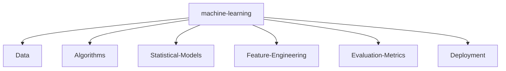

<h1 align="center"> Hello, I'm Fahim Hossain</h1>
<h3 align="center">I am a student studying computer science and engineering (CSE), and I have a strong background in front-end and back-end development. Graphics design, HTML, CSS, JavaScript, Java, C, PHP, Python, and MySQL are among the practical skills I possess. Because I love design and programming, I can make solutions that are dynamic, useful, and aesthetically pleasing. In the field of software development, I am excited to investigate cutting-edge technology and hone my abilities.</h3>

<p align="left">  </p>

<h3 align="left">Connect with me:</h3>
<p align="left">
</p>

<h3 align="left">Languages and Tools:</h3>
<p align="left"> <a href="https://www.blender.org/" target="_blank" rel="noreferrer">  </a> <a href="https://www.cprogramming.com/" target="_blank" rel="noreferrer">  </a> <a href="https://www.w3schools.com/cpp/" target="_blank" rel="noreferrer">  </a> <a href="https://www.w3schools.com/css/" target="_blank" rel="noreferrer">  </a> <a href="https://flutter.dev" target="_blank" rel="noreferrer">  </a> <a href="https://www.w3.org/html/" target="_blank" rel="noreferrer">  </a> <a href="https://www.adobe.com/in/products/illustrator.html" target="_blank" rel="noreferrer">  </a> <a href="https://www.java.com" target="_blank" rel="noreferrer">  </a> <a href="https://developer.mozilla.org/en-US/docs/Web/JavaScript" target="_blank" rel="noreferrer">  </a> <a href="https://www.linux.org/" target="_blank" rel="noreferrer">  </a> <a href="https://nodejs.org" target="_blank" rel="noreferrer">  </a> <a href="https://www.photoshop.com/en" target="_blank" rel="noreferrer">  </a> <a href="https://www.php.net" target="_blank" rel="noreferrer">  </a> <a href="https://www.python.org" target="_blank" rel="noreferrer">  </a> <a href="https://reactjs.org/" target="_blank" rel="noreferrer">  </a> </p>

<p></p>

<p>&nbsp;</p>

<p></p>
## 🥇 Primary technology stack


## 🥈 Secondary technology stack


## 🥉 Tertiary technology stack


---

## Thanks for visiting

<p align="center"> 


Counting of visitors to this page in this section started from May 1, 2022

<a href="http://s01.flagcounter.com/more/ap7"></a>
---

<!--   GitHub stats graph -->

### 📈 GitHub Activity Graph:

<!--   green snake -->


<!--   stats + languages -->

| .                                                                                                                                                 | .                                                                                                                              |
| ------------------------------------------------------------------------------------------------------------------------------------------------- | ------------------------------------------------------------------------------------------------------------------------------ |
|  |  |

</img>

<!-- dark snake -->


<!--   profile-green-animate -->


<!--   grid-snake  -->

<!--  TOP codersrank для обновления картинки нужно обновить профиль на странице https://profile.codersrank.io/user/idimetrix-->

</img>

<!--  2d history skills для обновления картинки нужно обновить профиль на странице https://profile.codersrank.io/user/idimetrix-->

</img>

<div align="center">
<summary>Trophy: Github Profile Trophy</summary>
</div>

<p align="center"> 
<a href="https://github.com/ryo-ma/github-profile-trophy"></a>
</p>

   <!--machine-learning-->




<!-- New York - My Home-->

```geojson
{
  "type": "FeatureCollection",
  "features": [
    {
      "type": "Feature",
      "id": 1,
      "properties": {
        "ID": 0
      },
      "geometry": {
        "type": "Polygon",
        "coordinates": [
          [
            [
              -74.2591,
              40.4774
            ],
            [
              -73.7004,
              40.9176
            ]
          ]
        ]
      }
    }
  ]
}
```


### Profile Views

counting of visitors to this page in this section started from June 12, 2022


</br>

[MIT](LICENSE)

---

<p align="center">
  
</p>
